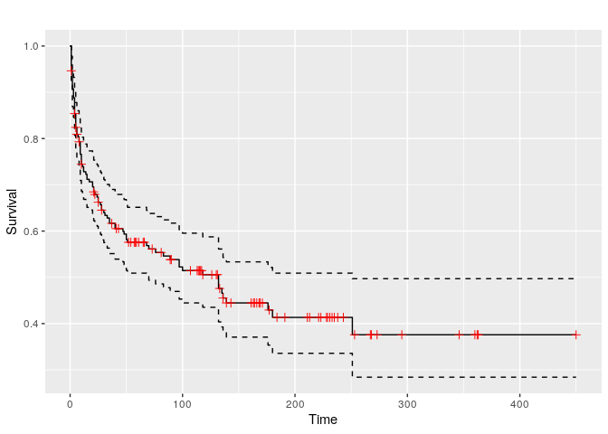
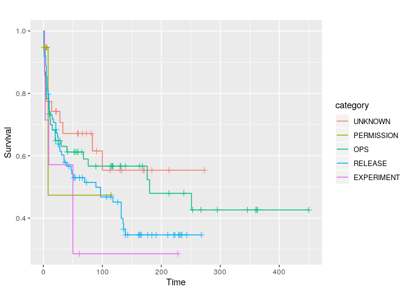
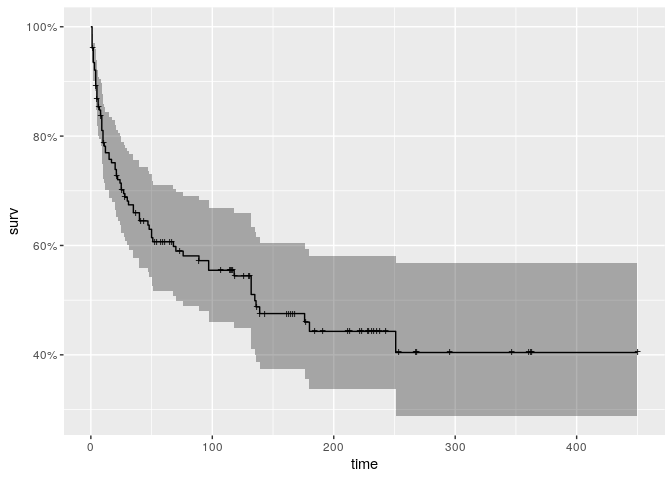
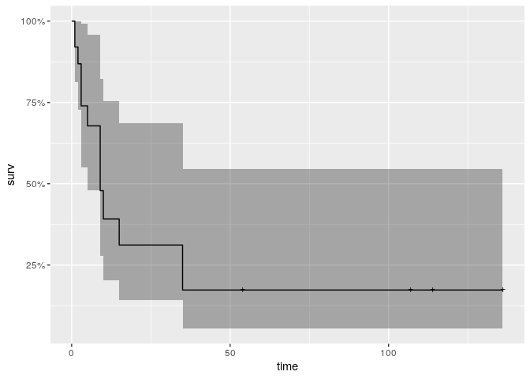
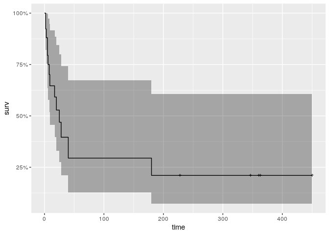

Survival of toggles and their categories
================

## Dataset overview

``` r
summary(data)
```

    ##      name            repo_name         all_routers_removed weeks_survived  
    ##  Length:206         Length:206         Mode :logical       Min.   :  1.00  
    ##  Class :character   Class :character   FALSE:107           1st Qu.:  6.00  
    ##  Mode  :character   Mode  :character   TRUE :99            Median : 45.00  
    ##                                                            Mean   : 77.55  
    ##                                                            3rd Qu.:131.00  
    ##                                                            Max.   :450.00  
    ##    category        
    ##  Length:206        
    ##  Class :character  
    ##  Mode  :character  
    ##                    
    ##                    
    ## 

``` r
data %>%
  ggplot( aes(x=category, y=weeks_survived, color=category) ) +
    geom_jitter()
```

<!-- -->

## Toggles survival per project

How many weeks the removed and living toggles have survived?

``` r
data %>%
  ggplot( aes(x=repo_name, y=weeks_survived, fill=repo_name) ) +
    geom_violin(scale = "width", draw_quantiles = c(0.5)) +
    geom_jitter(height = 0, width = 0.1, size = 0.5)  +
    theme(
      legend.position = "none"
    ) +
    coord_flip() +
    facet_grid(cols = vars(all_routers_removed)) +
    scale_y_log10() +
    xlab("") +
    ylab("Weeks survived")
```

<!-- -->

Preliminary notes:

  - Toggles not removed tend do live longer for most of the projects
  - Some projects like tndata\_backend and Jiller do not remove most of
    their toggles
  - In general, most projects remove their toggles before 100 weeks

## Aggregated survival by categories of toggles

How do categories of removed and living toggles compare?

``` r
data %>%
  ggplot( aes(x=category, y=weeks_survived, fill=category) ) +
    geom_violin(scale = "width", draw_quantiles = c(0.5)) +
    geom_jitter(height = 0, width = 0.1, size = 0.5) +
    coord_flip() +
    scale_y_log10() +
    facet_grid(cols = vars(all_routers_removed)) +
    theme(legend.position = "none") +
    xlab("") +
    ylab("Weeks survived")
```

<!-- -->

Preliminary notes:

  - Remaining RELEASE and OPS toggles tend to live longer than the
    toggles already removed
  - Lifetime of RELEASE and OPS toggles distribute similarly.
    **Statistically different? See Kaplan-Meier analysis below**
  - OPS toggles are removed earlier than RELEASE toggles

## Survival time of removed toggles per category

Useful to compare toggles lifetimes. For example, is a toggle living
longer than the other of the same category in a project?

``` r
data %>%
  # filter(repo_name == "edx-platform") %>%
  # filter(all_routers_removed == TRUE) %>%
  ggplot( aes(x=repo_name, y=weeks_survived, fill=repo_name) ) +
    geom_violin(scale = "width", draw_quantiles = c(0.5)) +
    geom_jitter(height = 0, width = 0.1, size = 0.5) +
    coord_flip() +
    scale_y_log10() +
    facet_grid(cols = vars(category), rows = vars(all_routers_removed)) +
    # facet_grid(cols = vars(category)) +
    theme(legend.position = "none") +
    xlab("") +
    ylab("Weeks survived")
```

<!-- -->

## Kaplan-Meier estimates

Notice that from now on `data.not.unknown` will be used as data source.

``` r
data.not.unknown <- data %>%
  filter(category != "UNKNOWN")

summary(data.not.unknown)
```

    ##      name            repo_name         all_routers_removed weeks_survived  
    ##  Length:175         Length:175         Mode :logical       Min.   :  1.00  
    ##  Class :character   Class :character   FALSE:88            1st Qu.:  6.00  
    ##  Mode  :character   Mode  :character   TRUE :87            Median : 40.00  
    ##                                                            Mean   : 77.69  
    ##                                                            3rd Qu.:131.50  
    ##                                                            Max.   :450.00  
    ##    category        
    ##  Length:175        
    ##  Class :character  
    ##  Mode  :character  
    ##                    
    ##                    
    ## 

``` r
data.not.unknown %>%
  ggplot( aes(x=category, y=weeks_survived, color=category) ) +
    geom_jitter()
```

<!-- -->

### Similarity of survival functions

Here’s a Cox Proportional Hazards Model. This will tell us which
covariates are more responsible for the removal of toggles.

``` r
cox <- data.not.unknown %>%
  coxph(formula = Surv(weeks_survived, all_routers_removed) ~ repo_name + category, data = .)

summary(cox)
```

    ## Call:
    ## coxph(formula = Surv(weeks_survived, all_routers_removed) ~ repo_name + 
    ##     category, data = .)
    ## 
    ##   n= 175, number of events= 87 
    ## 
    ##                                      coef exp(coef) se(coef)      z Pr(>|z|)
    ## repo_namecourse-discovery        -1.50936   0.22105  0.44988 -3.355 0.000794
    ## repo_nameecommerce               -1.34823   0.25970  0.41431 -3.254 0.001137
    ## repo_nameedx-analytics-dashboard -2.21577   0.10907  0.56219 -3.941  8.1e-05
    ## repo_nameedx-platform            -0.50666   0.60251  0.42603 -1.189 0.234339
    ## repo_nameJiller                  -2.59495   0.07465  1.47508 -1.759 0.078544
    ## repo_namekitsune                 -0.95382   0.38527  0.47020 -2.029 0.042507
    ## repo_nameosf.io                  -2.40127   0.09060  0.77997 -3.079 0.002079
    ## repo_namesocorro                 -0.77911   0.45882  0.61225 -1.273 0.203182
    ## repo_nametndata_backend          -2.59798   0.07442  0.83722 -3.103 0.001915
    ## repo_namewardenclyffe            -1.44749   0.23516  0.54637 -2.649 0.008066
    ## categoryOPS                      -0.83578   0.43354  0.53645 -1.558 0.119241
    ## categoryPERMISSION               -0.38287   0.68190  1.16247 -0.329 0.741887
    ## categoryRELEASE                  -0.60908   0.54385  0.56504 -1.078 0.281067
    ##                                     
    ## repo_namecourse-discovery        ***
    ## repo_nameecommerce               ** 
    ## repo_nameedx-analytics-dashboard ***
    ## repo_nameedx-platform               
    ## repo_nameJiller                  .  
    ## repo_namekitsune                 *  
    ## repo_nameosf.io                  ** 
    ## repo_namesocorro                    
    ## repo_nametndata_backend          ** 
    ## repo_namewardenclyffe            ** 
    ## categoryOPS                         
    ## categoryPERMISSION                  
    ## categoryRELEASE                     
    ## ---
    ## Signif. codes:  0 '***' 0.001 '**' 0.01 '*' 0.05 '.' 0.1 ' ' 1
    ## 
    ##                                  exp(coef) exp(-coef) lower .95 upper .95
    ## repo_namecourse-discovery          0.22105      4.524  0.091528    0.5339
    ## repo_nameecommerce                 0.25970      3.851  0.115296    0.5850
    ## repo_nameedx-analytics-dashboard   0.10907      9.168  0.036238    0.3283
    ## repo_nameedx-platform              0.60251      1.660  0.261413    1.3887
    ## repo_nameJiller                    0.07465     13.396  0.004144    1.3447
    ## repo_namekitsune                   0.38527      2.596  0.153293    0.9683
    ## repo_nameosf.io                    0.09060     11.037  0.019644    0.4179
    ## repo_namesocorro                   0.45882      2.180  0.138196    1.5233
    ## repo_nametndata_backend            0.07442     13.437  0.014424    0.3840
    ## repo_namewardenclyffe              0.23516      4.252  0.080592    0.6862
    ## categoryOPS                        0.43354      2.307  0.151495    1.2407
    ## categoryPERMISSION                 0.68190      1.466  0.069859    6.6561
    ## categoryRELEASE                    0.54385      1.839  0.179686    1.6461
    ## 
    ## Concordance= 0.681  (se = 0.034 )
    ## Rsquare= 0.199   (max possible= 0.99 )
    ## Likelihood ratio test= 38.9  on 13 df,   p=0.0002072
    ## Wald test            = 38.67  on 13 df,   p=0.0002255
    ## Score (logrank) test = 46.7  on 13 df,   p=1.086e-05

``` r
cox_fit <- survfit(cox)
autoplot(cox_fit)
```

<!-- -->

Preliminary notes:

  - Most projects significantly contribute to the removal of toggles
  - Survival of toggles across projects are statistically different
  - No category significantly contributes to the removal of toggles
  - Are OPS and RELEASE statistically similar? In general, no. Survival
    curves per category are statistically similar. See “Same for all
    projects?” sectio below.

#### Projects of the same company

**edX projects:**

``` r
data.not.unknown %>%
  filter(repo_name %in% edXProjects) %>%
  survdiff(Surv(.$weeks_survived, .$all_routers_removed) ~ repo_name, data = .)
```

    ## Call:
    ## survdiff(formula = Surv(.$weeks_survived, .$all_routers_removed) ~ 
    ##     repo_name, data = .)
    ## 
    ##                                    N Observed Expected (O-E)^2/E (O-E)^2/V
    ## repo_name=course-discovery        22       12    13.58  0.183718  2.68e-01
    ## repo_name=ecommerce               35       17    16.93  0.000307  4.96e-04
    ## repo_name=edx-analytics-dashboard 16        5    10.70  3.036434  4.11e+00
    ## repo_name=edx-platform            17       13     5.79  8.967513  1.09e+01
    ## 
    ##  Chisq= 13.1  on 3 degrees of freedom, p= 0.00452

**mozilla projects:**

``` r
data.not.unknown %>%
  filter(repo_name %in% mozillaProjects) %>%
  survdiff(Surv(.$weeks_survived, .$all_routers_removed) ~ repo_name, data = .)
```

    ## Call:
    ## survdiff(formula = Surv(.$weeks_survived, .$all_routers_removed) ~ 
    ##     repo_name, data = .)
    ## 
    ##                    N Observed Expected (O-E)^2/E (O-E)^2/V
    ## repo_name=bedrock 10       10     5.27     4.250     5.819
    ## repo_name=kitsune 19       14    17.24     0.609     1.580
    ## repo_name=socorro  5        5     6.49     0.343     0.463
    ## 
    ##  Chisq= 5.8  on 2 degrees of freedom, p= 0.0541

Preliminary notes:

  - Survival of toggles in edX projects is statistically different
  - Survival of toggles in mozilla projects are statistically similar

#### Same for all projects?

We know categories do not contribute for the overall survival of
toggles, but now that we know we should study projects individually,
this still stands for all the projects?

Following are the logrank tests to compare the survival curves. The null
hypothesis is the distributions are statistically equal. Evaulate using
`alpha = 0.05`

*Reminder:* if `p < alpha`, reject null hypothesis

``` r
for (i in unique(data$repo_name)) {
  dt <- data.not.unknown %>%
    group_by(repo_name) %>%
    filter(repo_name == i & n_distinct(category) > 1)
  
  if (nrow(dt) > 1) {
    print(i)
    print(survdiff(Surv(weeks_survived, all_routers_removed) ~ category, data = dt))
    cat('\n')
  }
}
```

    ## [1] "wardenclyffe"
    ## Call:
    ## survdiff(formula = Surv(weeks_survived, all_routers_removed) ~ 
    ##     category, data = dt)
    ## 
    ##                     N Observed Expected (O-E)^2/E (O-E)^2/V
    ## category=OPS        6        2   3.4391     0.602     1.426
    ## category=PERMISSION 1        1   0.0909     9.091    10.000
    ## category=RELEASE    4        3   2.4700     0.114     0.196
    ## 
    ##  Chisq= 10.6  on 2 degrees of freedom, p= 0.00509 
    ## 
    ## [1] "osf.io"
    ## Call:
    ## survdiff(formula = Surv(weeks_survived, all_routers_removed) ~ 
    ##     category, data = dt)
    ## 
    ##                  N Observed Expected (O-E)^2/E (O-E)^2/V
    ## category=OPS     2        1    0.282      1.83      2.16
    ## category=RELEASE 9        1    1.718      0.30      2.16
    ## 
    ##  Chisq= 2.2  on 1 degrees of freedom, p= 0.142 
    ## 
    ## [1] "course-discovery"
    ## Call:
    ## survdiff(formula = Surv(weeks_survived, all_routers_removed) ~ 
    ##     category, data = dt)
    ## 
    ##                      N Observed Expected (O-E)^2/E (O-E)^2/V
    ## category=OPS         7        1    4.094     2.338     3.846
    ## category=PERMISSION  1        0    0.314     0.314     0.338
    ## category=RELEASE    14       11    7.592     1.530     4.502
    ## 
    ##  Chisq= 4.5  on 2 degrees of freedom, p= 0.105 
    ## 
    ## [1] "ecommerce"
    ## Call:
    ## survdiff(formula = Surv(weeks_survived, all_routers_removed) ~ 
    ##     category, data = dt)
    ## 
    ##                   N Observed Expected (O-E)^2/E (O-E)^2/V
    ## category=OPS     16       10      6.5      1.89      3.32
    ## category=RELEASE 19        7     10.5      1.17      3.32
    ## 
    ##  Chisq= 3.3  on 1 degrees of freedom, p= 0.0685 
    ## 
    ## [1] "edx-analytics-dashboard"
    ## Call:
    ## survdiff(formula = Surv(weeks_survived, all_routers_removed) ~ 
    ##     category, data = dt)
    ## 
    ##                   N Observed Expected (O-E)^2/E (O-E)^2/V
    ## category=OPS      2        0    0.722     0.722     0.845
    ## category=RELEASE 14        5    4.278     0.122     0.845
    ## 
    ##  Chisq= 0.8  on 1 degrees of freedom, p= 0.358 
    ## 
    ## [1] "edx-platform"
    ## Call:
    ## survdiff(formula = Surv(weeks_survived, all_routers_removed) ~ 
    ##     category, data = dt)
    ## 
    ##                   N Observed Expected (O-E)^2/E (O-E)^2/V
    ## category=OPS      4        4      1.1     7.611      9.87
    ## category=RELEASE 13        9     11.9     0.706      9.87
    ## 
    ##  Chisq= 9.9  on 1 degrees of freedom, p= 0.00168 
    ## 
    ## [1] "bedrock"
    ## Call:
    ## survdiff(formula = Surv(weeks_survived, all_routers_removed) ~ 
    ##     category, data = dt)
    ## 
    ##                     N Observed Expected (O-E)^2/E (O-E)^2/V
    ## category=EXPERIMENT 1        1    0.211   2.94795   3.29693
    ## category=OPS        1        1    1.062   0.00365   0.00467
    ## category=RELEASE    8        8    8.727   0.06050   0.54181
    ## 
    ##  Chisq= 3.3  on 2 degrees of freedom, p= 0.192 
    ## 
    ## [1] "kitsune"
    ## Call:
    ## survdiff(formula = Surv(weeks_survived, all_routers_removed) ~ 
    ##     category, data = dt)
    ## 
    ##                     N Observed Expected (O-E)^2/E (O-E)^2/V
    ## category=EXPERIMENT 3        2     1.94   0.00172   0.00205
    ## category=OPS        8        4     8.38   2.28776   6.32508
    ## category=RELEASE    8        8     3.68   5.07193   7.78636
    ## 
    ##  Chisq= 8.4  on 2 degrees of freedom, p= 0.0151 
    ## 
    ## [1] "tndata_backend"
    ## Call:
    ## survdiff(formula = Surv(weeks_survived, all_routers_removed) ~ 
    ##     category, data = dt)
    ## 
    ##                     N Observed Expected (O-E)^2/E (O-E)^2/V
    ## category=EXPERIMENT 3        2     0.75      2.08      3.89
    ## category=OPS        9        0     1.25      1.25      3.89
    ## 
    ##  Chisq= 3.9  on 1 degrees of freedom, p= 0.0486

Preliminary notes:

  - The survival times by category distributes differently in
    wardenclyffe, edx-platform, kitsune and tndata\_backend.

**edx-platform**

``` r
dt <- data.not.unknown %>%
  filter(repo_name == "edx-platform")

cox <- coxph(Surv(weeks_survived, all_routers_removed) ~ category, data = dt)

summary(cox)
```

    ## Call:
    ## coxph(formula = Surv(weeks_survived, all_routers_removed) ~ category, 
    ##     data = dt)
    ## 
    ##   n= 17, number of events= 13 
    ## 
    ##                    coef exp(coef) se(coef)      z Pr(>|z|)   
    ## categoryRELEASE -2.0030    0.1349   0.6993 -2.864  0.00418 **
    ## ---
    ## Signif. codes:  0 '***' 0.001 '**' 0.01 '*' 0.05 '.' 0.1 ' ' 1
    ## 
    ##                 exp(coef) exp(-coef) lower .95 upper .95
    ## categoryRELEASE    0.1349      7.411   0.03427    0.5313
    ## 
    ## Concordance= 0.677  (se = 0.057 )
    ## Rsquare= 0.334   (max possible= 0.972 )
    ## Likelihood ratio test= 6.9  on 1 df,   p=0.00861
    ## Wald test            = 8.2  on 1 df,   p=0.00418
    ## Score (logrank) test = 10.81  on 1 df,   p=0.001008

``` r
cox_fit <- survfit(cox)
autoplot(cox_fit)
```

<!-- -->

Preliminary notes:

  - OPS does not appear in the list of covariates. *TODO: what does it
    mean?*
  - RELEASE is significantly associated with the length of toggles
    survival for edx-platform

**kitsune**

``` r
cox <- data.not.unknown %>%
  filter(repo_name == "kitsune") %>%
  coxph(formula = Surv(weeks_survived, all_routers_removed) ~ category, data = .)

summary(cox)
```

    ## Call:
    ## coxph(formula = Surv(weeks_survived, all_routers_removed) ~ category, 
    ##     data = .)
    ## 
    ##   n= 19, number of events= 14 
    ## 
    ##                    coef exp(coef) se(coef)      z Pr(>|z|)
    ## categoryOPS     -0.8424    0.4307   0.8705 -0.968    0.333
    ## categoryRELEASE  0.9847    2.6770   0.8373  1.176    0.240
    ## 
    ##                 exp(coef) exp(-coef) lower .95 upper .95
    ## categoryOPS        0.4307     2.3220   0.07819     2.372
    ## categoryRELEASE    2.6770     0.3735   0.51877    13.814
    ## 
    ## Concordance= 0.704  (se = 0.08 )
    ## Rsquare= 0.338   (max possible= 0.974 )
    ## Likelihood ratio test= 7.84  on 2 df,   p=0.01985
    ## Wald test            = 6.88  on 2 df,   p=0.03209
    ## Score (logrank) test = 8.36  on 2 df,   p=0.01533

``` r
cox_fit <- survfit(cox)
autoplot(cox_fit)
```

<!-- -->

Preliminary notes:

  - EXPERIMENT is missing from the model. *TODO: what does it mean?*
  - Toggles survive differently for OPS and RELEASE, but they do not to
    contribute significantly to the Cox regression model.
  - Low Rsquare, the dependent and independent variables are not
    strongly correlated
