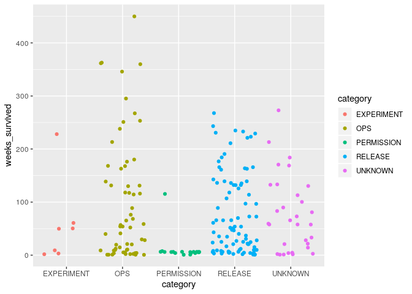
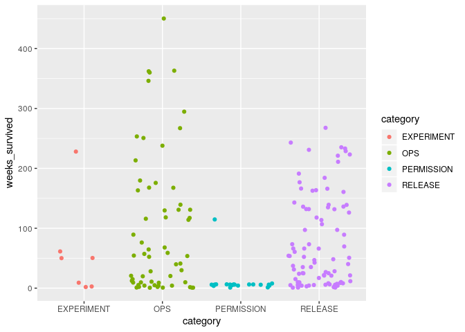

Survival of toggles and their categories
================

## Toggles survival per project

How many weeks the removed and living toggles have survived?

``` r
data %>%
  ggplot( aes(x=repo_name, y=weeks_survived, fill=repo_name) ) +
    geom_violin(scale = "width", draw_quantiles = c(0.5)) +
    geom_jitter(height = 0, width = 0.1, size = 0.5)  +
    theme(
      legend.position = "none"
    ) +
    coord_flip() +
    facet_grid(cols = vars(all_routers_removed)) +
    scale_y_log10() +
    xlab("") +
    ylab("Weeks survived")
```

<!-- -->

Preliminary notes:

  - Toggles not removed tend do live longer for most of the projects
  - Some projects like tndata\_backend and Jiller do not remove most of
    their toggles
  - In general, most projects remove their toggles before 100 weeks

## Aggregated survival by categories of toggles

How do categories of removed and living toggles compare?

``` r
data %>%
  ggplot( aes(x=category, y=weeks_survived, fill=category) ) +
    geom_violin(scale = "width", draw_quantiles = c(0.5)) +
    geom_jitter(height = 0, width = 0.1, size = 0.5) +
    coord_flip() +
    scale_y_log10() +
    facet_grid(cols = vars(all_routers_removed)) +
    theme(legend.position = "none") +
    xlab("") +
    ylab("Weeks survived")
```

<!-- -->

Preliminary notes:

  - Remaining RELEASE and OPS toggles tend to live longer than the
    toggles already removed
  - Lifetime of RELEASE and OPS toggles distribute similarly.
    **Statistically different? See Kaplan-Meier analysis below**
  - OPS toggles are removed earlier than RELEASE toggles

## Survival time of removed toggles per category

Useful to compare toggles lifetimes. For example, is a toggle living
longer than the other of the same category in a project?

``` r
data %>%
  filter(all_routers_removed == TRUE) %>%
  ggplot( aes(x=repo_name, y=weeks_survived, fill=repo_name) ) +
    geom_violin(scale = "width", draw_quantiles = c(0.5)) +
    geom_jitter(height = 0, width = 0.1, size = 0.5) +
    coord_flip() +
    scale_y_log10() +
    facet_grid(cols = vars(category)) +
    theme(legend.position = "none") +
    xlab("") +
    ylab("Weeks survived")
```

<!-- -->

## Kaplan-Meier estimates

### All toggles

``` r
sf.all.toggles <- data %>%
  survfit(Surv(.$weeks_survived, .$all_routers_removed) ~ 1, data = .)

summary(sf.all.toggles)
```

    ## Call: survfit(formula = Surv(.$weeks_survived, .$all_routers_removed) ~ 
    ##     1, data = .)
    ## 
    ##  time n.risk n.event survival std.err lower 95% CI upper 95% CI
    ##     1    206      11    0.947  0.0157        0.916        0.978
    ##     2    194       8    0.908  0.0202        0.869        0.948
    ##     3    186       4    0.888  0.0220        0.846        0.932
    ##     4    182       7    0.854  0.0247        0.807        0.904
    ##     5    172       6    0.824  0.0266        0.774        0.878
    ##     6    165       3    0.809  0.0275        0.757        0.865
    ##     7    151       1    0.804  0.0278        0.751        0.860
    ##     8    150       2    0.793  0.0285        0.739        0.851
    ##     9    147       5    0.766  0.0300        0.710        0.827
    ##    10    142       4    0.744  0.0310        0.686        0.808
    ##    11    137       1    0.739  0.0312        0.680        0.803
    ##    12    136       2    0.728  0.0317        0.669        0.793
    ##    14    134       1    0.723  0.0319        0.663        0.788
    ##    15    133       2    0.712  0.0324        0.651        0.778
    ##    17    131       1    0.706  0.0326        0.645        0.773
    ##    20    130       2    0.696  0.0330        0.634        0.763
    ##    21    128       2    0.685  0.0333        0.622        0.753
    ##    22    123       1    0.679  0.0335        0.617        0.748
    ##    24    121       1    0.674  0.0337        0.611        0.743
    ##    25    120       2    0.662  0.0341        0.599        0.733
    ##    27    117       1    0.657  0.0343        0.593        0.727
    ##    28    116       2    0.645  0.0346        0.581        0.717
    ##    30    113       1    0.640  0.0348        0.575        0.711
    ##    31    112       1    0.634  0.0349        0.569        0.706
    ##    33    111       1    0.628  0.0351        0.563        0.701
    ##    35    110       2    0.617  0.0353        0.551        0.690
    ##    40    107       2    0.605  0.0356        0.539        0.679
    ##    47    103       1    0.599  0.0357        0.533        0.674
    ##    48    102       1    0.593  0.0359        0.527        0.668
    ##    50    101       2    0.582  0.0361        0.515        0.657
    ##    51     99       1    0.576  0.0362        0.509        0.651
    ##    68     79       1    0.569  0.0365        0.501        0.645
    ##    70     78       1    0.561  0.0367        0.494        0.638
    ##    76     74       1    0.554  0.0370        0.486        0.631
    ##    83     72       1    0.546  0.0373        0.478        0.624
    ##    89     71       1    0.538  0.0376        0.470        0.617
    ##    97     68       2    0.522  0.0381        0.453        0.603
    ##   100     66       1    0.515  0.0383        0.445        0.595
    ##   118     58       1    0.506  0.0387        0.435        0.587
    ##   132     51       3    0.476  0.0400        0.404        0.561
    ##   135     46       1    0.466  0.0405        0.393        0.552
    ##   136     45       1    0.455  0.0409        0.382        0.543
    ##   139     43       1    0.445  0.0413        0.371        0.533
    ##   176     29       1    0.429  0.0426        0.353        0.522
    ##   180     27       1    0.413  0.0439        0.336        0.509
    ##   251     11       1    0.376  0.0536        0.284        0.497

``` r
ggsurv(sf.all.toggles)
```

<!-- -->

## All toggles by category

*TODO: Green (OPS) and blue (RELEASE) are indistinguisiable*

``` r
sf.all.toggles.category <- data %>%
  survfit(Surv(.$weeks_survived, .$all_routers_removed) ~ category, data = .)

summary(sf.all.toggles.category)
```

    ## Call: survfit(formula = Surv(.$weeks_survived, .$all_routers_removed) ~ 
    ##     category, data = .)
    ## 
    ##                 category=EXPERIMENT 
    ##  time n.risk n.event survival std.err lower 95% CI upper 95% CI
    ##     2      7       1    0.857   0.132       0.6334        1.000
    ##     3      6       1    0.714   0.171       0.4471        1.000
    ##     9      5       1    0.571   0.187       0.3008        1.000
    ##    50      4       2    0.286   0.171       0.0886        0.922
    ## 
    ##                 category=OPS 
    ##  time n.risk n.event survival std.err lower 95% CI upper 95% CI
    ##     1     60       5    0.917  0.0357        0.849        0.989
    ##     2     55       3    0.867  0.0439        0.785        0.957
    ##     4     52       3    0.817  0.0500        0.724        0.921
    ##     5     49       2    0.783  0.0532        0.686        0.895
    ##     9     47       2    0.750  0.0559        0.648        0.868
    ##    10     45       1    0.733  0.0571        0.630        0.854
    ##    11     43       1    0.716  0.0583        0.611        0.840
    ##    12     42       1    0.699  0.0593        0.592        0.826
    ##    15     41       1    0.682  0.0603        0.574        0.811
    ##    20     40       2    0.648  0.0619        0.537        0.781
    ##    30     36       1    0.630  0.0627        0.518        0.766
    ##    40     35       1    0.612  0.0635        0.499        0.750
    ##    68     27       1    0.589  0.0650        0.475        0.732
    ##    76     26       1    0.567  0.0664        0.450        0.713
    ##   176     13       1    0.523  0.0742        0.396        0.691
    ##   180     12       1    0.480  0.0798        0.346        0.665
    ##   251      9       1    0.426  0.0869        0.286        0.636
    ## 
    ##                 category=PERMISSION 
    ##  time n.risk n.event survival std.err lower 95% CI upper 95% CI
    ##     1     19       1    0.947  0.0512        0.852            1
    ##     8      2       1    0.474  0.3359        0.118            1
    ## 
    ##                 category=RELEASE 
    ##  time n.risk n.event survival std.err lower 95% CI upper 95% CI
    ##     1     89       3    0.966  0.0191        0.930        1.000
    ##     2     86       2    0.944  0.0244        0.897        0.993
    ##     3     84       2    0.921  0.0285        0.867        0.979
    ##     4     82       3    0.888  0.0335        0.824        0.956
    ##     5     79       3    0.854  0.0374        0.784        0.931
    ##     6     76       3    0.820  0.0407        0.744        0.904
    ##     7     73       1    0.809  0.0417        0.731        0.895
    ##     8     72       1    0.798  0.0426        0.719        0.886
    ##     9     70       2    0.775  0.0443        0.693        0.867
    ##    10     68       3    0.741  0.0465        0.655        0.838
    ##    12     65       1    0.729  0.0472        0.642        0.828
    ##    15     64       1    0.718  0.0478        0.630        0.818
    ##    17     63       1    0.707  0.0484        0.618        0.808
    ##    21     62       2    0.684  0.0494        0.593        0.788
    ##    22     59       1    0.672  0.0499        0.581        0.778
    ##    24     58       1    0.661  0.0504        0.569        0.767
    ##    25     57       2    0.637  0.0512        0.545        0.746
    ##    27     54       1    0.626  0.0516        0.532        0.735
    ##    28     53       1    0.614  0.0520        0.520        0.725
    ##    31     52       1    0.602  0.0523        0.508        0.714
    ##    35     51       2    0.578  0.0529        0.484        0.692
    ##    40     48       1    0.566  0.0531        0.471        0.681
    ##    47     46       1    0.554  0.0534        0.459        0.669
    ##    48     45       1    0.542  0.0536        0.446        0.658
    ##    51     44       1    0.529  0.0538        0.434        0.646
    ##    70     36       1    0.515  0.0542        0.419        0.633
    ##    89     33       1    0.499  0.0548        0.402        0.619
    ##    97     32       2    0.468  0.0556        0.371        0.591
    ##   118     28       1    0.451  0.0561        0.354        0.576
    ##   132     26       3    0.399  0.0571        0.302        0.528
    ##   135     23       1    0.382  0.0572        0.285        0.512
    ##   136     22       1    0.364  0.0572        0.268        0.496
    ##   139     20       1    0.346  0.0571        0.251        0.478
    ## 
    ##                 category=UNKNOWN 
    ##  time n.risk n.event survival std.err lower 95% CI upper 95% CI
    ##     1     31       2    0.935  0.0441        0.853        1.000
    ##     2     29       2    0.871  0.0602        0.761        0.997
    ##     3     27       1    0.839  0.0661        0.719        0.979
    ##     4     26       1    0.806  0.0710        0.679        0.958
    ##     5     25       1    0.774  0.0751        0.640        0.936
    ##    14     24       1    0.742  0.0786        0.603        0.913
    ##    28     21       1    0.707  0.0824        0.562        0.888
    ##    33     20       1    0.671  0.0855        0.523        0.862
    ##    83     12       1    0.615  0.0949        0.455        0.833
    ##   100     10       1    0.554  0.1035        0.384        0.799

``` r
ggsurv(sf.all.toggles.category)
```

<!-- -->

## All toggles per project

*TODO: Green (OPS) and blue (RELEASE) are indistinguisiable*

``` r
sf.all.toggles.project <- data %>%
  survfit(Surv(.$weeks_survived, .$all_routers_removed) ~ repo_name, data = .)

summary(sf.all.toggles.project)
```

    ## Call: survfit(formula = Surv(.$weeks_survived, .$all_routers_removed) ~ 
    ##     repo_name, data = .)
    ## 
    ##                 repo_name=bedrock 
    ##  time n.risk n.event survival std.err lower 95% CI upper 95% CI
    ##     1     11       2   0.8182  0.1163       0.6192        1.000
    ##     2      9       1   0.7273  0.1343       0.5064        1.000
    ##     4      8       1   0.6364  0.1450       0.4071        0.995
    ##     6      7       1   0.5455  0.1501       0.3180        0.936
    ##    10      6       2   0.3636  0.1450       0.1664        0.795
    ##    12      4       1   0.2727  0.1343       0.1039        0.716
    ##    25      3       1   0.1818  0.1163       0.0519        0.637
    ##    27      2       1   0.0909  0.0867       0.0140        0.589
    ##    31      1       1   0.0000     NaN           NA           NA
    ## 
    ##                 repo_name=course-discovery 
    ##  time n.risk n.event survival std.err lower 95% CI upper 95% CI
    ##     2     24       1    0.958  0.0408        0.882        1.000
    ##     4     23       1    0.917  0.0564        0.813        1.000
    ##    21     22       2    0.833  0.0761        0.697        0.997
    ##    48     19       1    0.789  0.0838        0.641        0.972
    ##    83     18       1    0.746  0.0899        0.589        0.944
    ##    97     17       1    0.702  0.0947        0.539        0.914
    ##   118     13       1    0.648  0.1016        0.476        0.881
    ##   132     11       3    0.471  0.1141        0.293        0.757
    ##   135      8       1    0.412  0.1141        0.240        0.709
    ##   136      7       1    0.353  0.1119        0.190        0.657
    ## 
    ##                 repo_name=ecommerce 
    ##  time n.risk n.event survival std.err lower 95% CI upper 95% CI
    ##     1     47       4    0.915  0.0407        0.838        0.998
    ##     2     43       2    0.872  0.0487        0.782        0.973
    ##     3     41       1    0.851  0.0519        0.755        0.959
    ##     4     40       5    0.745  0.0636        0.630        0.880
    ##     5     35       2    0.702  0.0667        0.583        0.846
    ##     6     33       1    0.681  0.0680        0.560        0.828
    ##    10     31       1    0.659  0.0693        0.536        0.810
    ##    15     30       1    0.637  0.0703        0.513        0.791
    ##    30     26       1    0.612  0.0718        0.487        0.771
    ##    47     25       1    0.588  0.0730        0.461        0.750
    ##    97     17       1    0.553  0.0764        0.422        0.725
    ##   139     10       1    0.498  0.0865        0.354        0.700
    ## 
    ##                 repo_name=edx-analytics-dashboard 
    ##  time n.risk n.event survival std.err lower 95% CI upper 95% CI
    ##     1     20       1     0.95  0.0487        0.859        1.000
    ##     7     19       1     0.90  0.0671        0.778        1.000
    ##    12     18       1     0.85  0.0798        0.707        1.000
    ##    70     17       1     0.80  0.0894        0.643        0.996
    ##    89     16       1     0.75  0.0968        0.582        0.966
    ##   100     15       1     0.70  0.1025        0.525        0.933
    ## 
    ##                 repo_name=edx-platform 
    ##  time n.risk n.event survival std.err lower 95% CI upper 95% CI
    ##     1     22       3    0.864  0.0732        0.732        1.000
    ##     2     19       1    0.818  0.0822        0.672        0.996
    ##     3     18       2    0.727  0.0950        0.563        0.939
    ##     5     16       2    0.636  0.1026        0.464        0.873
    ##     9     14       3    0.500  0.1066        0.329        0.759
    ##    10     11       1    0.455  0.1062        0.288        0.718
    ##    14     10       1    0.409  0.1048        0.248        0.676
    ##    15      9       1    0.364  0.1026        0.209        0.632
    ##    35      8       2    0.273  0.0950        0.138        0.540
    ## 
    ##                 repo_name=Jiller 
    ##         time       n.risk      n.event     survival      std.err lower 95% CI 
    ##       1.0000      17.0000       1.0000       0.9412       0.0571       0.8357 
    ## upper 95% CI 
    ##       1.0000 
    ## 
    ##                 repo_name=kitsune 
    ##  time n.risk n.event survival std.err lower 95% CI upper 95% CI
    ##     2     19       2    0.895  0.0704        0.767        1.000
    ##     3     17       1    0.842  0.0837        0.693        1.000
    ##     5     16       2    0.737  0.1010        0.563        0.964
    ##     6     14       1    0.684  0.1066        0.504        0.929
    ##     8     13       1    0.632  0.1107        0.448        0.890
    ##     9     12       1    0.579  0.1133        0.395        0.850
    ##    17     11       1    0.526  0.1145        0.344        0.806
    ##    20     10       1    0.474  0.1145        0.295        0.761
    ##    25      9       1    0.421  0.1133        0.249        0.713
    ##    28      8       1    0.368  0.1107        0.204        0.664
    ##    40      7       1    0.316  0.1066        0.163        0.612
    ##   180      6       1    0.263  0.1010        0.124        0.558
    ## 
    ##                 repo_name=osf.io 
    ##  time n.risk n.event survival std.err lower 95% CI upper 95% CI
    ##     2     15       1    0.933  0.0644        0.815            1
    ##    22     13       1    0.862  0.0911        0.700            1
    ##    28     12       1    0.790  0.1081        0.604            1
    ## 
    ##                 repo_name=socorro 
    ##  time n.risk n.event survival std.err lower 95% CI upper 95% CI
    ##     9      5       1      0.8   0.179       0.5161            1
    ##    68      4       1      0.6   0.219       0.2933            1
    ##    76      3       1      0.4   0.219       0.1367            1
    ##   176      2       1      0.2   0.179       0.0346            1
    ##   251      1       1      0.0     NaN           NA           NA
    ## 
    ##                 repo_name=tndata_backend 
    ##         time       n.risk      n.event     survival      std.err lower 95% CI 
    ##       50.000        9.000        2.000        0.778        0.139        0.549 
    ## upper 95% CI 
    ##        1.000 
    ## 
    ##                 repo_name=wardenclyffe 
    ##  time n.risk n.event survival std.err lower 95% CI upper 95% CI
    ##     8     13       1    0.923  0.0739        0.789        1.000
    ##    11     12       1    0.846  0.1001        0.671        1.000
    ##    20     11       1    0.769  0.1169        0.571        1.000
    ##    24     10       1    0.692  0.1280        0.482        0.995
    ##    33      9       1    0.615  0.1349        0.400        0.946
    ##    40      8       1    0.538  0.1383        0.326        0.891
    ##    51      7       1    0.462  0.1383        0.257        0.830

``` r
ggsurv(sf.all.toggles.project)
```

<!-- -->

### Similarity of survival functions

Are OPS and RELEASE statistically similar?

Following are the logrank tests to compare the groups. The null
hypothesis is the distributions are statistically equal. Evaulate using
`alpha = 0.05`

*Reminder:* if `p < alpha`, reject null hypothesis

#### Per category

``` r
data %>%
  # filter(category %in% c("RELEASE", "OPS", "PERMISSION", "EXPERIMENT", "UNKNOWN")) %>%
  survdiff(Surv(.$weeks_survived, .$all_routers_removed) ~ category, data = .)
```

    ## Call:
    ## survdiff(formula = Surv(.$weeks_survived, .$all_routers_removed) ~ 
    ##     category, data = .)
    ## 
    ##                      N Observed Expected (O-E)^2/E (O-E)^2/V
    ## category=EXPERIMENT  7        5     2.96     1.410     1.485
    ## category=OPS        60       28    31.38     0.365     0.553
    ## category=PERMISSION 19        2     3.93     0.947     1.061
    ## category=RELEASE    89       52    45.17     1.034     1.952
    ## category=UNKNOWN    31       12    15.56     0.816     0.989
    ## 
    ##  Chisq= 4.7  on 4 degrees of freedom, p= 0.318

Preliminary notes:

  - Survival curves per category are statistically similar
  - UNKNOWN is more similar to OPS than RELEASE
  - PERMISSION is more similar to UNKNOWN than RELEASE
  - RELEASE toggles survivability is the most alike of the categories

#### Per project

``` r
data %>%
  survdiff(Surv(.$weeks_survived, .$all_routers_removed) ~ repo_name, data = .)
```

    ## Call:
    ## survdiff(formula = Surv(.$weeks_survived, .$all_routers_removed) ~ 
    ##     repo_name, data = .)
    ## 
    ##                                    N Observed Expected (O-E)^2/E (O-E)^2/V
    ## repo_name=bedrock                 11       11     2.73    25.124   26.9753
    ## repo_name=course-discovery        24       13    15.09     0.289    0.3523
    ## repo_name=ecommerce               47       21    21.94     0.040    0.0526
    ## repo_name=edx-analytics-dashboard 20        6    14.33     4.844    5.8997
    ## repo_name=edx-platform            22       16     7.65     9.124   10.1944
    ## repo_name=Jiller                  17        1     3.04     1.373    1.5433
    ## repo_name=kitsune                 19       14     9.00     2.771    3.1581
    ## repo_name=osf.io                  15        3     7.35     2.574    2.8829
    ## repo_name=socorro                  5        5     3.20     1.013    1.0678
    ## repo_name=tndata_backend          13        2     6.47     3.092    3.4331
    ## repo_name=wardenclyffe            13        7     8.20     0.175    0.1965
    ## 
    ##  Chisq= 52.3  on 10 degrees of freedom, p= 1e-07

Preliminary notes:

  - Survival of toggles across projects are statistically different

**edX projects:**

``` r
data %>%
  filter(repo_name %in% c("course-discovery", "ecommerce", "edx-analytics-dashboard", "edx-platform")) %>%
  survdiff(Surv(.$weeks_survived, .$all_routers_removed) ~ repo_name, data = .)
```

    ## Call:
    ## survdiff(formula = Surv(.$weeks_survived, .$all_routers_removed) ~ 
    ##     repo_name, data = .)
    ## 
    ##                                    N Observed Expected (O-E)^2/E (O-E)^2/V
    ## repo_name=course-discovery        24       13    14.33  0.123460   0.17128
    ## repo_name=ecommerce               47       21    20.86  0.000981   0.00162
    ## repo_name=edx-analytics-dashboard 20        6    13.11  3.853359   5.28292
    ## repo_name=edx-platform            22       16     7.71  8.926008  10.89380
    ## 
    ##  Chisq= 13.8  on 3 degrees of freedom, p= 0.00326

Preliminary notes:

  - Survival of toggles in edX projects is not statistically similar

**mozilla projects:**

``` r
data %>%
  filter(repo_name %in% c("bedrock", "kitsune", "socorro")) %>%
  survdiff(Surv(.$weeks_survived, .$all_routers_removed) ~ repo_name, data = .)
```

    ## Call:
    ## survdiff(formula = Surv(.$weeks_survived, .$all_routers_removed) ~ 
    ##     repo_name, data = .)
    ## 
    ##                    N Observed Expected (O-E)^2/E (O-E)^2/V
    ## repo_name=bedrock 11       11     5.60     5.199      7.18
    ## repo_name=kitsune 19       14    17.77     0.799      2.06
    ## repo_name=socorro  5        5     6.63     0.401      0.54
    ## 
    ##  Chisq= 7.2  on 2 degrees of freedom, p= 0.0275

Preliminary notes:

  - Survival of toggles in mozilla projects is not statistically similar
