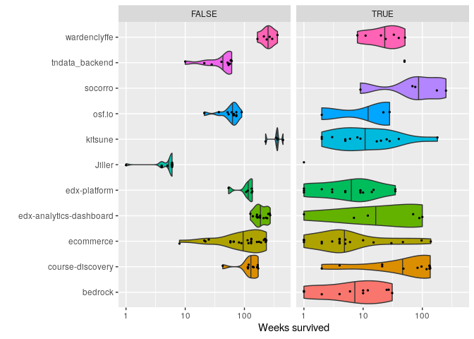
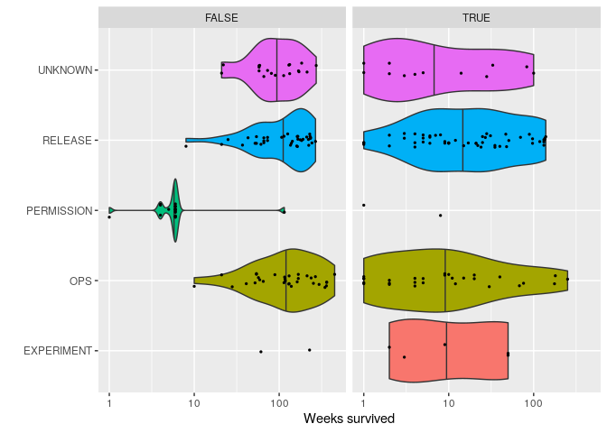

Survival of toggles by categories
================

### Toggles survival per project

``` r
data %>%
  ggplot( aes(x=repo_name, y=weeks_survived, fill=repo_name) ) +
    geom_violin(scale = "width", draw_quantiles = c(0.5)) +
    theme(
      legend.position = "none"
    ) +
    coord_flip() +
    facet_grid(cols = vars(all_routers_removed)) +
    scale_y_log10() +
    xlab("") +
    ylab("Weeks survived")
```

<!-- -->

### Survival time of removed toggles per category

Useful to compare toggles lifetimes. For example, is a toggle living
longer than the other of the same category in a project?

``` r
data %>%
  filter(all_routers_removed == TRUE) %>%
  ggplot( aes(x=repo_name, y=weeks_survived, fill=repo_name) ) +
    geom_violin(scale = "width", draw_quantiles = c(0.5)) +
    coord_flip() +
    scale_y_log10() +
    facet_grid(cols = vars(category)) +
    theme(legend.position = "none") +
    xlab("") +
    ylab("Weeks survived")
```

<!-- -->

# Categories of toggles and their removal

How do categories compare? Whether toggles are removed or not.

``` r
data %>%
  ggplot( aes(x=category, y=weeks_survived, fill=category) ) +
    geom_violin(scale = "width", draw_quantiles = c(0.5)) +
    geom_jitter(height = 0, width = 0.1) +
    coord_flip() +
    scale_y_log10() +
    facet_grid(rows = vars(all_routers_removed)) +
    theme(legend.position = "none") +
    xlab("") +
    ylab("Weeks survived")
```

<!-- -->
